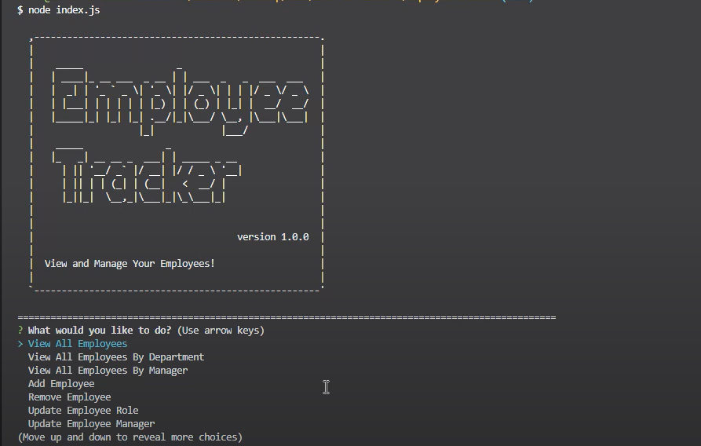
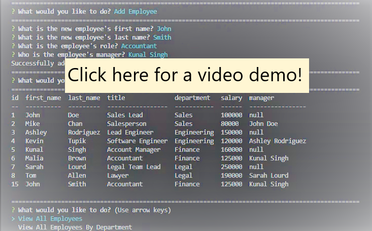

# Employee Tracker

***
<p align="center">
  
  
</p>

[](https://opensource.org/licenses/MIT)



Please click on the below screenshot for a video demo on using this application!
[](https://www.youtube.com/watch?v=RgpUPVZGlDU&feature=youtu.be&ab_channel=Christina2021)

## Table of Contents
* [Description](#description)
* [Installation](#installation)
* [Usage](#usage)
* [Questions](#questions)
* [License](#license)

<br>

## Description
Keep track of your employees using this Employee Tracker app!  With this application, you will be able to view all employees that are currently in the database, as well as manage/update the information!
<br>

## Installation
Please see the following command needed in order to use this application:<br>
```bash
npm i
node index.js
```
This application will require Node.js and MySQL.  Please make sure these are installed.
You will also need to enter in your MySQL password in the connection.js file in order to create the employee database in MySQL (using the schema.sql file).  Example data will be provided in the seed.sql file.

<br>

## Usage
Please see the following instructions on how to use this application: <br>
⭐In the terminal, enter in the command "node index" or "node index.js" in order for the application to run.<br>
⭐There will be a series of prompts that you may utilize to manage your employee database. This will include managing the employee information, company roles, and company departments.  Data that is pulled up will be organized in a table.<br>
⭐Prompts to manage employee information will include viewing all employees, viewing employees under a specific department, and viewing employees by which manager they work under.  New employees may be added, and employees may also be deleted.  The employee data that may be modified in the database includes updating their role or the manager they work under.<br>
⭐Prompts to manage company roles include viewing all roles, adding a new role, as well as removing a role.<br>
⭐Prompts to manage company departments include viewing all departments, viewing the total utilized budget of a department, adding a new department, and removing a department.<br>
⭐When finished, the Quit option will close the application.

<br>

## Questions?
Feel free to check out my github profile [here](https://github.com/Christina2021)!
Should you have any questions, you may reach me by e-mail at: <a href="mailto:codechristina2021@gmail.com?subject=Hi,%20Christina!">codechristina2021@gmail.com</a>!.

## License
[MIT](https://choosealicense.com/licenses/mit/#)